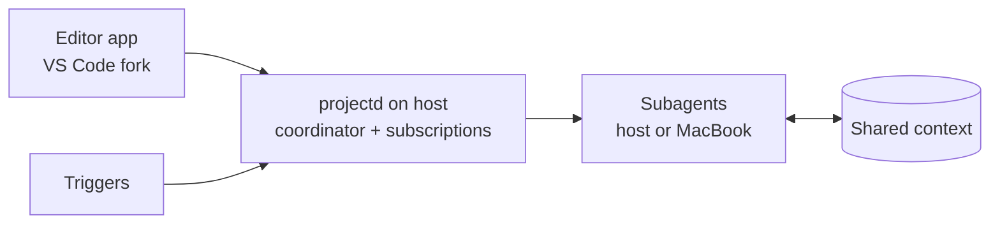

# Wisp: Project Plan

Updated Sep 24, 2026

## Overview

An open-source macOS app that reproduces the Cursor Projects workflow. One coordinator chat plans the work and spawns subagents that share project context.

The reference architecture is Cursor's [Introducing Projects](https://cursor.com/blog/projects) (Sep 10, 2026). The difference: the always-on host is a machine you own, and model calls go through your own AI subscriptions, managed inside the app.

## Goals and non-goals

Goals:

* Run projects on the MacBook, the Mac mini, or any machine reachable over SSH
* Manage your AI subscriptions inside the app and route every model call through them, with raw API keys as a fallback
* Good performance
* Include basic editor features for quick changes and commands, built on a stripped-down fork of VS Code (Code - OSS)

Non-goals:

* A hosted cloud service
* Windows or Linux clients in v1

## Core concepts

| Concept | What it is | Cursor equivalent |
| --- | --- | --- |
| Project | A body of work that outlives one chat: a feature, a migration, or ongoing upkeep | Project |
| Coordinator Agent | The chat you talk to. It plans and delegates but never writes code, so it is never blocked. | Coordinator Agent |
| Subagent | A worker that runs one task in its own git worktree on an assigned machine | Subagent |
| Shared context | A folder of Markdown files synced to every machine. Agents add research, test instructions, and your preferences. | Shared context |
| Host | The machine running the project: the MacBook, or an external computer such as the Mac mini | Cloud computer |
| Local agent | A subagent on your laptop, started when something must run there | Local agent |
| Trigger | A schedule, Slack channel, or PR watch that wakes the coordinator | Subscription |

Cursor calls triggers subscriptions. This plan says triggers to avoid confusion with AI subscriptions.

## Architecture

Two programs. An editor app built on a VS Code fork that renders and sends commands, and one Rust binary (`projectd`) that does everything else. The control role runs on the host, which can be the MacBook or an external computer. With an external host, closing the MacBook does not stop a project.

* Editor app: a stripped-down VS Code fork. Chat with the coordinator, review diffs, and make quick edits.
* Host daemon (`projectd`): runs the coordinator, listens for triggers, and stores project state.
* Subagents: run tasks on the host by default, or on the MacBook when something must run locally.
* Shared context: Markdown files synced to every machine.
* Subscription manager: holds your AI logins and API keys and routes model calls through them.

## MVP and milestones

The MVP is one project on one host: a coordinator, two parallel subagents, shared context files, and diffs reviewable from the MacBook.

| Milestone | Done when |
| --- | --- |
| M0: Editor fork | A stripped-down Code - OSS fork builds on macOS with the editor, file tree, and terminal |
| M1: Host daemon | `projectd` runs on the MacBook or an external host and talks to the editor |
| M2: Subscription manager | One subscription login and one API key work, model calls route through them, and usage shows per account |
| M3: Single agent | One subagent completes a task in a worktree and writes to shared context |
| M4: Coordinator | The coordinator plans and runs two subagents in parallel. On an external host it keeps working with the MacBook closed. |
| M5: Local agent | With an external host, the coordinator starts a subagent on the MacBook to run something locally |
| M6: Triggers | A schedule and a PR watch wake the coordinator without a prompt |
| M7: Open source release | README, license, install steps, and a short demo |

## Open questions and risks

Decided: the VS Code fork is the client. There is no separate SwiftUI app.

Open questions:

* Confirm the name wisp after conflict checks
* How shared context syncs: git commits in the repo, or a separate folder the daemon copies?
* Which triggers matter first: schedule, GitHub PRs, or Slack?
* Is `projectd` shared with Roster?
* Which providers does the subscription manager support first?
* Which UI changes from Cursor's layout do you want?

Risks:

* Subscription terms. Using consumer subscription logins from a third-party app may break vendor terms, and shipping it in a public open-source app makes that more visible. Keep API keys as a fallback.
* Coordinator quality. Weak task specs make workers fail. Start with the strongest model and grade plans by hand.
* Fork upkeep. A VS Code fork must be rebased on upstream releases, and stripping it down is ongoing work. Use Open VSX, since the Microsoft extension marketplace is not licensed for forks.
* Rust learning curve. Build the protocol and SQLite layers first.

## Name

Working name: wisp. A thin strand of smoke, and the will-o'-the-wisp light that leads travelers. It fits agents working quietly in the background. The command is `wisp`.

Known overlap: a web framework for the Gleam language is also called Wisp. GitHub, domain, and trademark checks are still to do.
