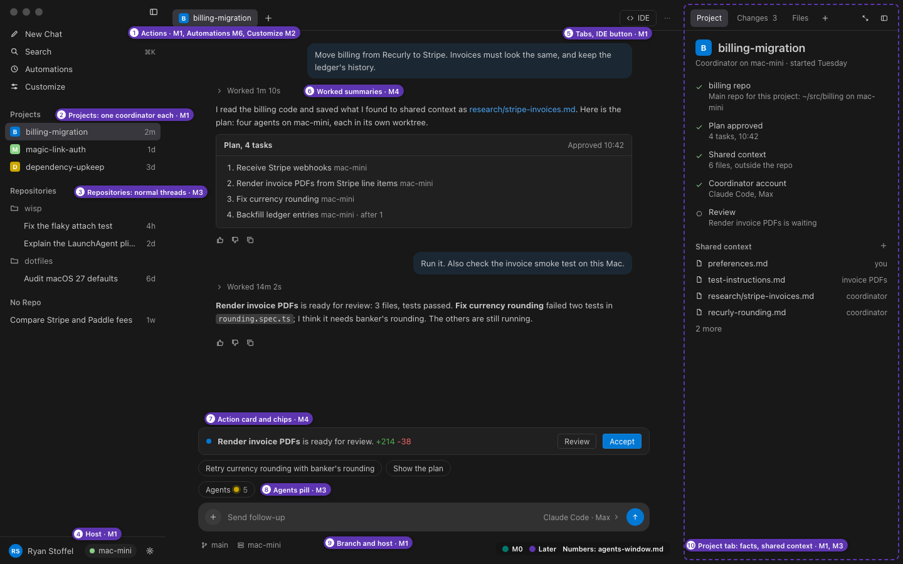

# wisp on the Agents window

- Status: design for M0 to M4, from #100, revised after Ryan's decisions and his Cursor Projects reference. It supersedes [coordinator-chat.md](coordinator-chat.md).
- Decision: [0011](../decisions/0011-agents-window-baseline.md). Builds on 0004, 0005, and 0007. [0015](../decisions/0015-subagent-chats.md) records how #105 built the Agents pill, panel, and subagent tabs.
- Upstream: the Agents window of Code - OSS 1.139.0 (`src/vs/sessions/`).
- Reference: Ryan's Cursor Projects screenshot, described on #100, and the Agents pill: [reference/cursor-agents-pill.png](agents-window/reference/cursor-agents-pill.png).

Wisp opens straight into upstream's Agents window, with Copilot's parts removed.

- **Left sidebar** (wisp's own view), from the top: actions; Projects, where each project is one row, its coordinator; Repositories, with normal threads under each repo; No Repo; and a footer with you, the host, and settings.
- **Center:** the selected thread, with collapsed "Worked" summaries, action cards and chips above the composer, an **Agents** pill that lists the coordinator's subagents, and a composer whose footer shows the branch and host.
- **Subagents:** opening one from the pill puts it in a tab next to the coordinator, where you can message it directly.
- **Right panel:** tabs for the project's facts and shared context, Changes, and Files.
- **IDE** opens the editor window.



## Mockups

All at 1440x900. The `-notes` images carry numbered annotations: teal for M0, purple for later milestones.

| Scene | Dark | Light | Annotated |
| --- | --- | --- | --- |
| Project (coordinator) thread, M4 | [coordinator-dark.png](agents-window/coordinator-dark.png) | [coordinator-light.png](agents-window/coordinator-light.png) | [coordinator-notes.png](agents-window/coordinator-notes.png) |
| Agents panel open from the pill, M3 | [agents-dark.png](agents-window/agents-dark.png) | [agents-light.png](agents-window/agents-light.png) | [agents-notes.png](agents-window/agents-notes.png) |
| A subagent in a tab, messaged directly, M3 | [subagent-dark.png](agents-window/subagent-dark.png) | [subagent-light.png](agents-window/subagent-light.png) | [subagent-notes.png](agents-window/subagent-notes.png) |
| Diff review of one worktree, M3 | [review-dark.png](agents-window/review-dark.png) | [review-light.png](agents-window/review-light.png) | [review-notes.png](agents-window/review-notes.png) |
| Host menu from the sidebar footer, M1 | [host-dark.png](agents-window/host-dark.png) | [host-light.png](agents-window/host-light.png) | [host-notes.png](agents-window/host-notes.png) |
| What M0 ships (#12) | [m0-dark.png](agents-window/m0-dark.png) | [m0-light.png](agents-window/m0-light.png) | [m0-notes.png](agents-window/m0-notes.png) |

Upstream's window as it is, with no Copilot, from the #100 experiment, is in [agents-window/upstream/](agents-window/upstream/): the sign-in gate (1), the empty shell past it in dark and light (2, 3), the workspace picker (4), and the window with #10's exclusions (5).

## Annotations

| # | Surface | How it is built | Milestone | Issue |
| --- | --- | --- | --- | --- |
| 1 | Actions: New Chat, Search, Automations, Customize | wisp's sidebar view. New Chat opens upstream's new-session composer for a `wisp.thread`. Search is a Quick Pick over projects and threads. Automations opens upstream's Automations surface once #18 settles triggers; until then it is hidden. Customize opens wisp's settings: hosts, then accounts. | M1; Automations M6; Customize M2 | #104, #18 |
| 2 | Projects: one row per project, with a glyph, its name, and a relative age. `+` starts a project. | `wisp.project` sessions; the coordinator is the main chat | M1 shell, M4 live | #104 |
| 3 | Repositories and No Repo: normal threads | `wisp.thread` sessions, grouped by workspace; No Repo holds quick chats | M3 | #110 |
| 4 | Host chip in the sidebar footer, and the host menu | wisp's sidebar view and a Quick Pick; `remoteConnectionStatus` on sessions | M0 static, M1 live | #12, #65, #104 |
| 5 | Center tab strip, `+`, **IDE**, and `...` | Upstream's chat tabs and session toolbar; **Open in Editor** relabeled **IDE** | M0 (IDE), M3 (tabs) | #103, #105 |
| 6 | Collapsed "Worked 1m 10s" summaries, replies, thumbs, copy | Upstream's chat widget, fed by wisp's `IChatSession` | M4 | M4 issues |
| 7 | Action card ("Render invoice PDFs is ready for review", Review, Accept) and suggestion chips | Chat confirmation parts and follow-ups from wisp's content provider | M4 | M4 issues |
| 8 | **Agents** pill, and the Agents panel it opens: status dot, task title, where it runs, state; about five rows, then **More**; a close button | Upstream's subagent pill (`sessionBackgroundActivitiesControl.ts`), with a small patch for status and location, and a panel presentation if the pill's options can't give one | M3 | #105 |
| 9 | Composer footer: branch and host, for example `main` and `mac-mini` | A contribution to the session chat input toolbar | M1 | #104 |
| 10 | Right panel **Project** tab: project name, a checklist of facts, and shared context | A `wisp.project` container in the auxiliary bar, first and default; Changes and Files stay upstream's | M1 facts, M3 shared context | #104, #106 |
| 11 | Clicking a subagent opens it as a tab next to the coordinator | Upstream's `ISessionsService.openChat` on a tool-origin chat | M3 | #105 |
| 12 | Messaging a subagent directly | `interactivity: Full`; wispd's new `agent/send` | M3 | #105 |
| 13 | Changes tab: the viewed agent's worktree | `IChat.changes`, and one changeset per worktree | M3 | #105 |
| 14 | Diff review in the detail pane | Upstream's Changes editor in the single-pane detail layout | M3 | #105 |
| 15 | Review bar: **Accept**, **Request changes** | Menu contributions on the changeset; #68 decides Accept | M3 | #105, #68 |
| 16 | wisp's sidebar with no projects yet | wisp's sidebar view and the empty provider | M0 | #12 |
| 17 | No host connected | A Custom View Grid view (`AbstractCustomView`) | M0 | #12 |
| 18 | Wisp opens here at launch | The `startup:` patch | M0 | #103 |

## Layout

| Part | Upstream | wisp |
| --- | --- | --- |
| Sidebar, 264 px | Upstream's Sessions list, AI Customizations, and the account menu | wisp's own `wisp.threads` view: actions, Projects, Repositories, No Repo, and a footer with the user, the host chip, and a settings gear. Upstream's container is excluded (#103). |
| Center card | The session's chat, with chat tabs once more than one chat is visible | The same. Tabs are the project's coordinator plus any subagents you opened. The toolbar has `+`, **IDE**, and `...`. |
| Right panel, 340 px | Changes and Files in the auxiliary bar | **Project** (wisp's), then upstream's Changes and Files |
| Detail pane | Editors next to the session | Diff review and shared context files |
| Panel | Terminal | The same, in the thread's worktree on the host (later) |
| Custom View Grid | Full-surface contributed views | The no-host state (M0) |

There is no activity bar and no status bar. Host status lives in the sidebar footer, and the composer footer names the host for each thread.

## Threads and subagents

- **A project is one thread**: a `wisp.project` session whose main chat is the coordinator. Its sidebar row never expands.
- **Subagents are chats inside the project's session**, of origin `Tool`, with the coordinator's chat as `parentChat`. They never appear in the sidebar.
- **The Agents pill** shows above the coordinator's composer once the coordinator has started a subagent. Its label counts the agents, with a running dot while any runs. Clicking it opens the Agents panel over the bottom of the transcript.
  - Each row: a status dot; the task title; where it runs (a monitor and "this Mac", or a server glyph and the host's name); and the state as text (Writing tests, Needs review, Failed, Queued).
  - The newest agents come first, about five rows, then **More**, which expands the list in place.
  - Escape or the close button closes the panel.
- **Clicking a row** opens that subagent as a tab to the right of the coordinator, and makes it active.
  - The tab shows the status dot and the task title.
  - Its thread starts with the coordinator's task as a quoted message, then the agent's work.
  - Its composer is enabled, with the placeholder **Message this agent**, and its footer shows the agent's branch and host.
  - A message you send goes to the agent. wispd tells the coordinator, so the coordinator's plan stays accurate.
  - Closing the tab hides the subagent again; the pill still lists it.
- **A normal thread** (`wisp.thread`) is one agent with no coordinator, under its repo or under No Repo (#110).

## States

The chat states, copy, and error table in [coordinator-chat.md](coordinator-chat.md) carry over, adapted:

- **Where they render.** Empty and error states render in the session surface. Connection-level problems use the no-host custom view and the host chip.
- **The agents strip is gone.** The Agents pill and panel replace it.
- **Agent status** keeps a text label next to every mark:

| wisp state | `IChat.status` | Mark | Text in the panel |
| --- | --- | --- | --- |
| Queued | `InProgress`, description "Queued" | Hollow dot | Queued |
| Running | `InProgress` | Filled dot with a halo, `chat.sessionStateIndicator.inProgressBorder` | The current step, such as "Writing tests" |
| Needs review | `NeedsInput` | Filled dot, `agentsBadge.background` | Needs review |
| Conflicts with {agent} (M4, #70) | `NeedsInput` | Filled dot | Conflicts with {agent} |
| Done | `Completed` | Filled dot, `charts.green` | Done |
| Failed | `Error` | Diamond, `errorForeground` | Failed |
| Stopped | `Completed` | Square | Stopped |

### M0 (#12)

- Wisp opens into the Agents window at launch, with no sign-in modal and none of Copilot's parts (#103).
- wisp's sidebar shows the actions (New Chat disabled until a host connects) and an empty Projects section: **No projects yet. A project runs on a host, so it shows here once wisp connects to one.** Repositories and No Repo stay hidden while empty.
- The footer shows the user, a host chip reading **Not connected** with a hollow dot, and the settings gear.
- The session surface shows the no-host custom view: **No host connected**, the body text from coordinator-chat.md, and a disabled composer whose placeholder is **Not connected to a host**. It reuses #12's pattern: a `readonly` textarea with `aria-disabled` and `aria-describedby`, and upstream's `Button`.

## Naming

wisp's labels: **Projects**, **Repositories**, **No Repo**, **New Chat**, **Search**, **Automations**, **Customize**, **Agents**, **IDE**, **Project**, and **Send follow-up** or **Message this agent** in the composer.

- Labels in wisp's own sidebar view and Project panel are wisp's strings and cost no patches.
- Two upstream labels change by patch: **Open in Editor** becomes **IDE**, and the pill's **Subagents** becomes **Agents**.
- The composer placeholder comes from wisp's chat session contribution where upstream allows it. Otherwise upstream's text stays, rather than patching `newChatInput.ts`, which changed 90 lines from 1.138.0 to 1.139.0.

## Theming

- Colors and sizes come only from theme tokens, read from the running Agents window, including its own (`agents*`, `activeSessionView.*`, `agentsChatInput.*`, `chat.sessionStateIndicator.*`).
- `chat.*` tokens are fine in this window, since upstream's chat renders wisp's threads.
- State is never shown by color alone: each mark has a distinct shape and a text label.
- The mocks draw line icons as inline SVG in the spirit of codicons. The product uses codicons (`server`, `vm`, `git-branch`, `gear`, `code`).

## Keyboard and accessibility

- ⌘N is New Chat, and ⌘K is Search.
- In the Agents panel, ↑ and ↓ move between rows, Enter opens the agent's tab, and Escape closes the panel and returns focus to the pill.
- Each panel row is labeled "{title}, {state}, on {host}".
- The pill is a button with `aria-expanded`, labeled "Agents, {n}, {k} running".
- The host chip is a button labeled "Host: {host}, {state}", and its changes are announced politely.
- The no-host custom view is `role="region"`, labeled "No host connected", with the composer described by the reason.
- Accessible View and help for transcripts come from upstream's chat widget.

## Revising the mockups

The sources are in [`agents-window/src/`](agents-window/src/): `index.html` loads `tokens.css` and `agents.css`, and `mock.js` builds each scene from URL parameters (`?scene=agents&theme=dark-modern&notes=0`).

Playwright is not a repo dependency, so run both scripts from a temp directory that has it:

```sh
cd "$(mktemp -d)" && npm install playwright-core@1.63.0 && npx playwright-core install chromium
node <repo>/docs/design/agents-window/src/render.mjs            # writes the PNGs at 1440x900
WISP_EDITOR_DIR=<repo>/editor/vscode \
  node <repo>/docs/design/agents-window/src/capture-tokens.mjs  # after an upstream upgrade
```

`capture-tokens.mjs` needs a development build in which the Agents window opens: after #103, or with patch 0010 undone locally. It uses a throwaway `HOME` and profile and in-memory secret storage, so it never reads the Keychain or your own agent sessions.
