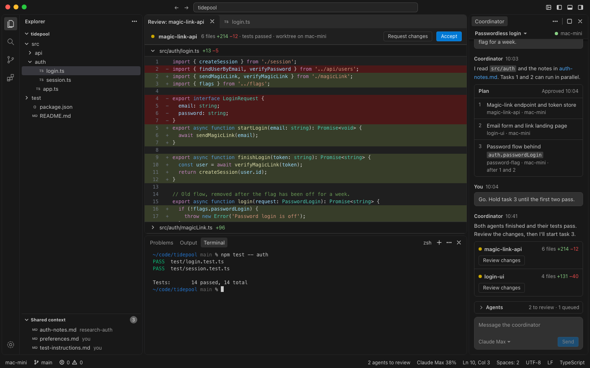
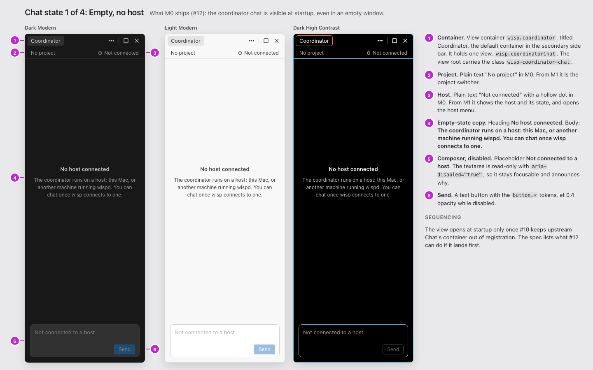
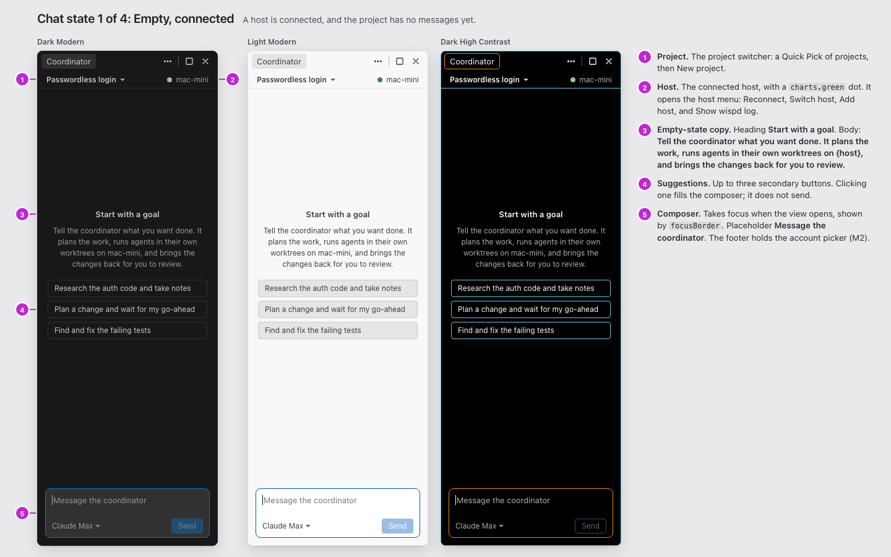
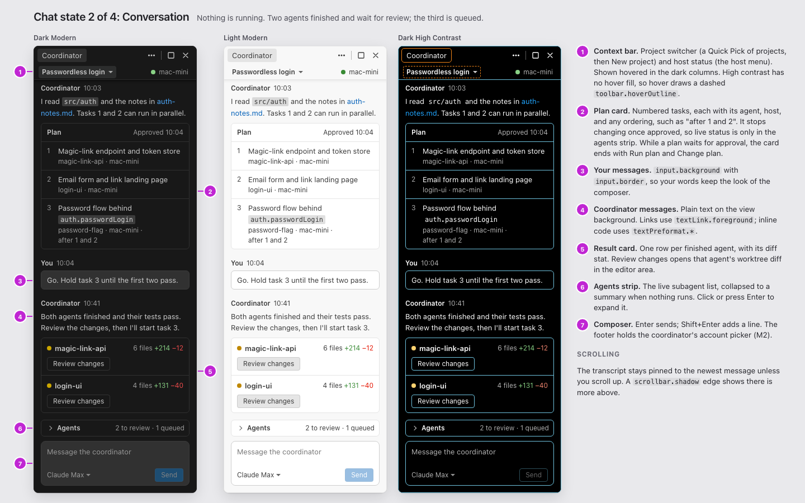
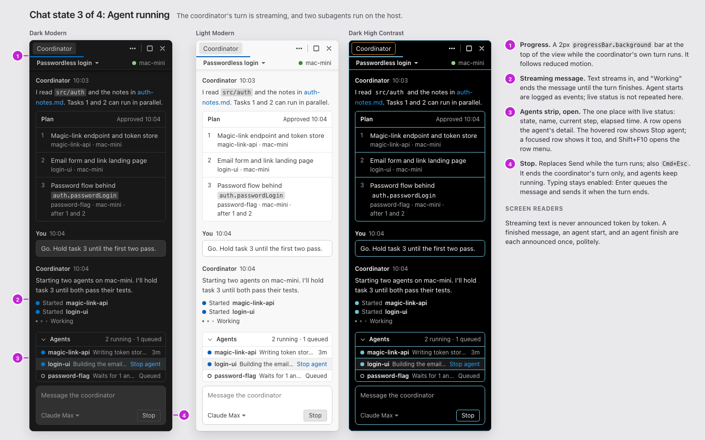
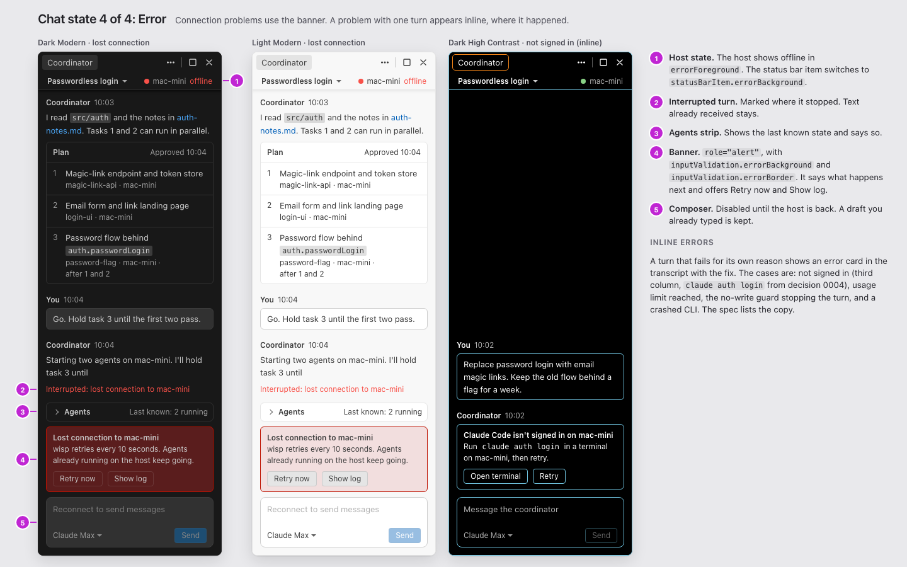

# Coordinator chat and workbench layout

- Status: **superseded** by [agents-window.md](agents-window.md) and decision [0011](../decisions/0011-agents-window-baseline.md). Ryan chose upstream's Agents window as the baseline on #14, so layout A below, a coordinator view in the editor window's secondary side bar, will not be built. The states, copy, and error table still apply, as agents-window.md describes. The rest is kept as the record of #11.
- Original status: design for M0, from #11. The layout follows the proposed default in #14.
- Builds on: #12 (M0 placeholder view), #10 (stripping the workbench), and decisions [0002](../decisions/0002-editor-fork-strategy.md), [0004](../decisions/0004-subscription-providers.md), and [0005](../decisions/0005-shared-context-folder.md).
- Upstream: Code - OSS 1.139.0, with its default Modern UI.

The coordinator chat lives in the secondary side bar on the right, in a wisp view container that is open at startup in every window. The file tree stays on the left, the editor in the center, and the terminal in the bottom panel. Later milestones fill in around the chat without moving it. Host status goes in the status bar, the project switcher and the agent list go inside the chat view, shared context goes in the Explorer, and diff review goes in the editor area.

## Mockups

| Image | What it shows |
| --- | --- |
| [workbench-dark.png](coordinator-chat/workbench-dark.png) | The full workbench in Dark Modern at M4, with every surface filled in |
| [workbench-light.png](coordinator-chat/workbench-light.png) | The same in Light Modern |
| [workbench-m0-dark.png](coordinator-chat/workbench-m0-dark.png) | What M0 ships once #12 lands |
| [state-1-empty.png](coordinator-chat/state-1-empty.png) | Empty state with no host: what M0 ships |
| [state-1-empty-connected.png](coordinator-chat/state-1-empty-connected.png) | Empty state, connected, with no messages yet |
| [state-2-conversation.png](coordinator-chat/state-2-conversation.png) | Conversation state |
| [state-3-running.png](coordinator-chat/state-3-running.png) | Agent running state |
| [state-4-error.png](coordinator-chat/state-4-error.png) | Error state: lost connection, and an inline error |
| [option-b-agents-first.png](coordinator-chat/option-b-agents-first.png) | The alternative posted on #14. Not adopted. |

The state boards show the chat view at 1:1 in Dark Modern, Light Modern, and Dark High Contrast. Wherever VS Code draws a codicon, the mocks draw a plain shape or use a text label; they use no icon fonts.



## Workbench layout

| Part | Holds | At first launch |
| --- | --- | --- |
| Title bar | Back and forward, the Command Center, and the layout toggles | Visible |
| Activity bar | Explorer, Search, Source Control, and Extensions; Manage at the bottom | Visible |
| Primary side bar, left | Explorer: the folder tree. From M3, a Shared context section below it. | Visible with a folder open; hidden in an empty window, as upstream |
| Editor area | Files, diffs, per-agent review (M3), and agent detail (M3) | Visible. No welcome page. |
| Panel, bottom | Terminal (the default tab), Problems, and Output. From M1, Output has a `wispd` channel. | Hidden, as upstream; Ctrl+\` opens it |
| Secondary side bar, right | The Coordinator container with the coordinator chat | Visible in every window, including empty ones |
| Status bar | From M1 the host, from M2 account usage, from M4 an agent summary; then upstream's editor items | Visible |

1.139.0 turns on `workbench.experimental.modernUI` by default. It draws the side bars, panel, and editor as floating cards with 4 px gutters and `cornerRadius.large` (8 px) corners, and it uses sentence-case titles. wisp keeps it. The chat uses only theme and size tokens, so it follows whatever upstream does with the chrome.

### Settings wisp sets

#12 registers both defaults in code, with `registerDefaultConfigurations`, from the same contribution that registers the view (see the build notes). Two other routes don't work in 1.139.0:

- `product.json` can't carry them, because `IProductConfiguration` has no field for setting defaults.
- A built-in extension's `configurationDefaults` reaches startup only through a cache written on an earlier run, so the first launch would get upstream's defaults.

| Setting | Value | Why |
| --- | --- | --- |
| `workbench.secondarySideBar.defaultVisibility` | `"visible"` | Upstream's default, `visibleInWorkspace`, hides the chat in an empty window except on a brand-new profile. The `coordinator-chat` screenshot scenario from #4 launches with no folder. |
| `workbench.startupEditor` | `"none"` | The chat is where you start, not the welcome page. |

The secondary side bar keeps upstream's default width, min(300 px, a quarter of the window): 300 px at 1440, and 256 px in the 1024 px screenshot window. The user's width persists, as upstream. The chat must work from 220 px up to a maximized side bar. If 300 px proves tight once agent cards exist, a one-line patch could raise the default to min(360 px, a quarter). That is not part of M0; #69 revisits it in M4.

### Hidden by default

#10 decides what is removed from the build. This layout needs the following hidden by default:

- **Upstream Chat**: its `workbench.panel.chat` container must not be registered at all; hiding it is not enough (see [Sequencing with #10](#sequencing-with-10)). Every entry point to Chat is hidden too: the title bar chat and Sign In buttons, the chat status bar item, inline chat, the agent sessions views, the Agents window, and chat setup. wisp's coordinator replaces Chat, and 0002 keeps wisp's features out of upstream's chat code.
- **Activity bar**: everything except Explorer, Search, Source Control, and Extensions. For example, Run and Debug, Testing, Remote Explorer, and Accounts.
- **Status bar**: upstream's remote indicator, whose far-left slot becomes wisp's host item in M1, and the Copilot item.
- **Panel**: Debug Console and Ports, if #10 keeps them.
- **Startup**: the welcome page, via `workbench.startupEditor: "none"`.

### Empty window

With no folder open, the primary side bar is hidden and the editor shows its letterpress, both as upstream. The chat is visible and shows its empty state. Once #10 has removed upstream Chat's container, the #4 screenshot scenario finds `.wisp-coordinator-chat` without any extra steps. Until then, see [Sequencing with #10](#sequencing-with-10).

## M0 build notes for #12

| Item | Value |
| --- | --- |
| View container | ID `wisp.coordinator`, title "Coordinator", in the secondary side bar as its default container, `order: 0`. The side bar shows the title as a text label; the codicon `comment-discussion` appears only when labels are off. |
| View | ID `wisp.coordinatorChat`, name "Chat", `singleViewPaneContainerTitle: "Coordinator"`, `canToggleVisibility: false`, `canMoveView: true` |
| Root element | `div.wisp-coordinator-chat`, which the #4 scenario waits for |
| Default visibility | Visible at startup in every window. #12 registers `workbench.secondarySideBar.defaultVisibility: "visible"` and `workbench.startupEditor: "none"` as defaults, as shown below. |
| Sequencing | #12 depends on #10 keeping upstream Chat's container out of registration. See [Sequencing with #10](#sequencing-with-10). |
| M0 content | The empty state's no-host variant, with the copy below and a disabled composer. The context bar is plain text. |
| Focus command | `wisp.coordinatorChat.focus`, which VS Code creates for every view. Bind ⌃⌘I to it through the view descriptor's `focusCommand` once #10 removes upstream chat's binding for that chord. |
| Styles | [`src/chat.css`](coordinator-chat/src/chat.css) is a reference, not a drop-in port. See [What chat.css only mocks](#what-chatcss-only-mocks). |

Register everything from a workbench contribution in a wisp-owned directory, the way upstream Chat registers its own container in `chatParticipant.contribution.ts`:

```ts
const container = Registry.as<IViewContainersRegistry>(ViewExtensions.ViewContainersRegistry).registerViewContainer({
	id: 'wisp.coordinator',
	title: localize2('wisp.coordinator', "Coordinator"),
	ctorDescriptor: new SyncDescriptor(ViewPaneContainer, ['wisp.coordinator', { mergeViewWithContainerWhenSingleView: true }]),
	storageId: 'wisp.coordinator',
	order: 0,
}, ViewContainerLocation.AuxiliaryBar, { isDefault: true });

Registry.as<IViewsRegistry>(ViewExtensions.ViewsRegistry).registerViews([{
	id: 'wisp.coordinatorChat',
	name: localize2('wisp.coordinatorChat', "Chat"),
	containerTitle: container.title.value,
	singleViewPaneContainerTitle: container.title.value,
	canToggleVisibility: false,
	canMoveView: true,
	ctorDescriptor: new SyncDescriptor(CoordinatorChatViewPane),
}], container);

Registry.as<IConfigurationRegistry>(ConfigurationExtensions.Configuration).registerDefaultConfigurations([{
	overrides: {
		'workbench.secondarySideBar.defaultVisibility': 'visible',
		'workbench.startupEditor': 'none',
	},
}]);
```

- `isDefault` is the third argument to `registerViewContainer`, and `mergeViewWithContainerWhenSingleView` goes in the `ViewPaneContainer` constructor descriptor.
- All three calls run when the module is imported. That is before `layout.ts` reads the default visibility.

Don't use `contributes.viewsContainers` in an extension instead. Containers contributed by extensions are never the default: `viewsExtensionPoint.ts` passes no `isDefault`, and they register only after the layout has read its state. `layout.ts` then hides the secondary side bar at startup, because it has no default container. A wisp-owned directory that `prepare` copies in is also 0002's advice for larger new code.

Use a native view pane, not a webview. It reads the `--vscode-*` variables directly, keeps focus handling in the workbench, and avoids an iframe on the product's main surface.

### Sequencing with #10

At startup, the secondary side bar opens the first enabled default container, in registration order (`getDefaultViewContainer` in `viewDescriptorService.ts`). It does not check whether that container is empty.

Upstream Chat registers `workbench.panel.chat` as a default when `chat.shared.contribution.js` loads, at line 230 of `workbench.common.main.ts`, and `workbench.desktop.main.ts` imports the common main first. So a wisp contribution imported from the desktop main, or anywhere after that line, registers second, and Chat stays the default. Until Chat's container is gone:

- the secondary side bar opens on Chat;
- the Coordinator view is never created;
- the #4 scenario's wait for `.wisp-coordinator-chat` fails.

So #12 depends on #10 keeping Chat's container out of registration. That is 0002's rule 4: exclude from registration, don't delete files. Hiding Chat's view with a `when` clause or with `chat.disableAIFeatures` is not enough, because the empty container stays the default. #10 should keep `platform/chat/common/chatSettings.ts`, since `layout.ts` imports it.

If #12 has to land before #10, pick one of these, and undo it when #10 lands:

| Option | How | Cost |
| --- | --- | --- |
| Import ahead of Chat | Import #12's contribution in `workbench.common.main.ts`, before `chat.shared.contribution.js` | The Coordinator becomes the first default at startup. The price is a patch line inside upstream's busiest import list, which conflicts whenever upstream edits the lines around it. Chat's container still registers, so Chat can still appear as a second tab in the secondary side bar. |
| Reveal in the scenario | Add a `wisp.coordinatorChat.focus` step to the `coordinator-chat` scenario's `run` | No ordering patch. But wisp starts on upstream Chat, and the screenshot shows a revealed view, not the real startup. |

### What chat.css only mocks

`src/chat.css` uses real tokens, but some of it exists only to draw static pictures. Replace these when building:

| In the mock | In the product |
| --- | --- |
| `.is-hover` on the context bar buttons and agent rows | `:hover` |
| `.is-focused` on the composer and buttons | `:focus-within` and `:focus-visible` |
| `.is-disabled` on the composer and buttons | The real disabled state, or `[aria-disabled="true"]` |
| `.is-scrolled` on the transcript | Set from the scroll position, or the scrollable element's own shadow |
| `.wisp-chat-progress`, fixed at 38% width | Upstream's `ProgressBar`, through the view's progress indicator |
| The fake caret and placeholder `<span>` in the composer | A real `textarea` with `::placeholder` |
| The transcript with `overflow: hidden`, pinned to the bottom | A scrollable list, such as a `WorkbenchList`, that keeps the newest message in view |
| `--mock-mono` | The editor font settings |

## Chat view anatomy

From top to bottom:

1. **Container title.** VS Code chrome: "Coordinator", plus upstream's standard actions (More actions, Maximize, Hide).
2. **Context bar**, 28 px tall. On the left is the project switcher, on the right the host status. Both are plain text in M0 and become buttons in M1.
3. **Progress bar.** A 2 px bar across the top edge, shown only while the coordinator's own turn runs.
4. **Transcript.** Pinned to the newest message unless you scroll up. When scrolled, it shows the `scrollbar.shadow` edge.
   - Your messages: a filled block.
   - Coordinator messages: Markdown on the view background, covering paragraphs, lists, inline code, code blocks, and links to files, agents, and shared context.
   - Cards: the plan card (numbered tasks, each with its agent and host; it records the plan and stops changing once approved), event lines ("Started magic-link-api"), and result cards (one row per finished agent with its diff stat and Review changes).
   - Markers: an interrupted marker, and inline error cards.
5. **Agents strip** (M3 and later): the live list of subagents. It collapses to a one-line summary when nothing runs.
6. **Banner slot**, for connection-level problems.
7. **Composer.** The textarea grows from 2 to 8 lines. Its footer holds the coordinator's account picker on the left (M2) and Send, or Stop, on the right.

Measurements are all token-based:

- Spacing: 12 px side padding (`spacing.size120`) and 16 px between messages (`spacing.size160`).
- Type: body text is `fontSize.body1` (13 px) on a 20 px line, secondary text `fontSize.label1` (12 px), and headings `fontWeight.semiBold`.
- Corners: `cornerRadius.medium` (6 px) on messages and cards, `cornerRadius.large` (8 px) on the composer, and `cornerRadius.small` (4 px) on buttons.
- Buttons are 24 px tall, and status dots are 8 px.

## States

### Empty





| Variant | Context bar | Body | Composer |
| --- | --- | --- | --- |
| No host (M0, and later whenever no daemon is connected) | "No project"; "Not connected" with a hollow dot | Heading **No host connected**. Body: **The coordinator runs on a host: this Mac, or another machine running wispd. You can chat once wisp connects to one.** | Disabled; placeholder **Not connected to a host** |
| Connected, no messages | Project name and host | Heading **Start with a goal**. Body: **Tell the coordinator what you want done. It plans the work, runs agents in their own worktrees on {host}, and brings the changes back for you to review.** Below it, up to three suggestion buttons that fill the composer without sending. | Enabled and focused; placeholder **Message the coordinator** |

From M1, the no-host variant adds two actions under the body: **Use this Mac** and **Connect to a host...**. M0 has no way to connect, so its copy names no action.

### Conversation



- Nothing is running.
- A plan waiting for approval ends with **Run plan**, a primary button, and **Change plan**, a secondary one that puts the cursor in the composer.
- Once approved, the plan card's header reads **Approved {time}**, and the card stops changing. Each task shows its agent and host, plus any ordering, such as "after 1 and 2". Live status lives only in the agents strip. If the coordinator revises the plan, it posts a new card, and the old card's header reads **Replaced**.
- A finished agent shows as needs review until you accept its changes.
- The agents strip collapses to a summary, such as "2 to review · 1 queued".

### Agent running



- While the coordinator's own turn runs, the progress bar shows, the message streams and ends with "Working", and **Stop** replaces **Send**.
- Stop ends the coordinator's turn only; running agents keep going. To stop one agent, use **Stop agent** on its row in the agents strip. The row shows it on hover and on keyboard focus, and it is also in the row menu (Shift+F10).
- Typing stays enabled. Enter queues the message; it shows at the end of the transcript marked Queued, with a Cancel link, and sends when the turn ends.
- The agents strip opens while agents run, and it is the one place with live status. Each row shows the state, name, current step, and elapsed time. The transcript keeps events ("Started login-ui") and results, not live rows.

Agent states:

| State | Dot |
| --- | --- |
| Queued | Hollow dot, `descriptionForeground` |
| Running | `progressBar.background` |
| Needs review | `charts.yellow` |
| Conflicts with {agent} (M4) | `charts.yellow` |
| Done (accepted) | `charts.green` |
| Failed | `errorForeground` |
| Stopped | `descriptionForeground` |

- The label always appears next to the dot.
- The plan card shows no agent state; it records the plan as approved.
- **Conflicts with {agent}** is reserved for M4. It applies when another agent's accepted changes overlap this agent's, so its diff is stale or won't apply. The review bar then says: **{agent}'s accepted changes touch the same files. Ask the coordinator to update this agent before you review.** Its actions are **Ask to update** (primary) and **Review anyway**. #70 decides detection and resolution.

### Error



A connection-level problem shows in three places:

- the host in the context bar,
- the status bar item,
- a banner above the composer, which disables the composer.

A problem with one turn shows as an error card in the transcript, where it happened, and the composer stays usable.

| Cause | Where | Copy | Actions |
| --- | --- | --- | --- |
| Lost connection to the host | Banner, context bar, status bar | **Lost connection to {host}.** wisp retries every 10 seconds. Agents already running on the host keep going. | Retry now, Show log |
| wispd not running on the host | Banner | **wispd isn't running on {host}.** Start it on the host, then retry. | Retry, Show log |
| Coordinator CLI not signed in (0004) | Inline card | **Claude Code isn't signed in on {host}.** Run `claude auth login` in a terminal on {host}, then retry. For Codex, the command is `codex login`. | Open terminal, Retry |
| Usage limit reached (0004, `rate_limit_event`) | Inline card; warning banner while it lasts | **{Account} limit reached.** It resets at {time}. | Switch account, Retry at reset |
| No-write guard stopped the turn (0004) | Inline card | **The coordinator changed files, so wispd stopped its turn.** The coordinator plans but never edits. wisp did not revert the changes. | Show changes, Retry |
| Turn failed for another reason | Inline card | **The coordinator's turn failed.** A disclosure shows the exit code and the last event. | Retry, Show log |
| An agent failed | Agent row and a result card | **{agent} failed:** the reason in one line, such as "tests failed". | Open agent, Retry agent |

- The interrupted turn keeps the text it already received and is marked "Interrupted: {reason}" in `errorForeground`.
- While offline, the agents strip shows the last known state and says so.
- While offline, the composer's placeholder is **Reconnect to send messages**. A draft already typed in the composer is kept.

## Interactions and keyboard

| Key | Where | Does |
| --- | --- | --- |
| ⌃⌘I | Anywhere | Reveals the secondary side bar if hidden, and focuses the composer. It reuses upstream chat's chord. |
| ⌥⌘B | Anywhere | Toggles the secondary side bar (upstream) |
| Enter | Composer | Sends, or queues while the coordinator's turn runs |
| Shift+Enter | Composer | Adds a new line |
| ⌘Esc | Chat | Stops the coordinator's turn. It reuses upstream chat's cancel chord. |
| ⌘↑ | Composer, cursor at start | Focuses the last message. It reuses upstream chat's chord. |
| ↑ and ↓ | Empty composer | Steps through messages you sent |
| ↑, ↓, Home, End | Transcript | Moves between messages |
| Enter, then Esc | A message | Enter moves into the message's links and buttons; Esc returns to the message |
| Esc | Transcript | Returns to the composer |
| ← and → | Context bar | Moves between the project switcher and the host status |
| ↑ and ↓ | Agents strip rows | Moves between agents. The focused row shows its actions, as on hover. |
| Enter | Agent row | Opens the agent's detail |
| Shift+F10, or the context menu key | Agent row | Opens the row menu: Open agent, Review changes, Stop agent |

- **Focus order (Tab):**
  1. the context bar, one Tab stop (← and → move between its two buttons);
  2. the transcript, one Tab stop;
  3. the agents strip header;
  4. the agents strip rows, one Tab stop;
  5. banner actions;
  6. the composer;
  7. the account picker;
  8. Send or Stop.
- **When the view is revealed or focused:** the composer takes focus, even when disabled.
- **Project switcher (M1):** a Quick Pick of projects, each showing its host and state, with New project... at the end. A window shows one project. Choosing another opens it in this window, like Open Recent; ⌘-click opens it in a new window. #67 decides which folder a project's window opens: a local clone, the host's copy, or an agent worktree.
- **Host status (M1):** a Quick Pick with Reconnect, Switch host..., Add host..., and Show wispd log.
- **Links:**
  - A file path opens the file.
  - A shared context file opens its host copy (see Future surfaces).
  - An agent name opens that agent's detail.
  - Review changes opens the agent's diff review.
- **Scrolling:** new content scrolls the transcript only if it is already at the bottom. Otherwise a **Jump to newest** button appears above the composer.
- **Narrow widths:** below 260 px the host label truncates and keeps its dot. Below 240 px the account picker moves into the More actions menu.

## Theming

Rules:

- Use only VS Code theme tokens and size tokens; no hex values.
- Use no `chat.*` tokens. They belong to upstream's chat contribution, which #10 removes.
- State is never shown by color alone.

Every token below is registered in `platform/theme` or `workbench/common/theme.ts`.

| Element | Tokens |
| --- | --- |
| View background and text | `sideBar.background`, `sideBar.foreground`, falling back to `foreground` |
| Secondary text: times, meta, empty-state body | `descriptionForeground` |
| Context bar | `sideBarSectionHeader.border` (bottom rule); on hover, `toolbar.hoverBackground` plus `toolbar.hoverOutline` as a 1 px dashed outline; `fontSize.label1` |
| Your messages | `input.background`, `input.foreground`, `input.border` |
| Links, agent row actions | `textLink.foreground`, `textLink.activeForeground` |
| Inline code | `textPreformat.foreground`, `textPreformat.background` |
| Code blocks | `textCodeBlock.background`, `widget.border`, and the editor font |
| Cards, agents strip | `surface.background`, `surface.foreground`, `widget.border` |
| Agent row hover and focus | `list.hoverBackground`; `list.focusOutline` when focused |
| Status dots | `progressBar.background`, `charts.green`, `charts.yellow`, `errorForeground`, `descriptionForeground` |
| Diff stat | `charts.green` (added), `charts.red` (removed) |
| Progress bar | `progressBar.background` |
| Error banner and cards | `inputValidation.errorBackground`, `inputValidation.errorBorder`, `inputValidation.errorForeground`, falling back to `foreground` |
| Warning banner | `inputValidation.warningBackground`, `inputValidation.warningBorder`, `inputValidation.warningForeground` |
| Composer | `input.background`, `input.border`, `input.foreground`, `input.placeholderForeground`, `editorCursor.foreground`; `focusBorder` when focused; `disabledForeground` for the placeholder when disabled |
| Buttons | `button.background`, `button.foreground`, `button.hoverBackground`, `button.border`; the secondary variants `button.secondaryBackground`, `button.secondaryForeground`, `button.secondaryHoverBackground`, `button.secondaryBorder`. Disabled buttons use 0.4 opacity, as VS Code's button does. |
| Focus | `focusBorder`, as a 1 px outline |
| Scrolled transcript | `scrollbar.shadow` |
| Status bar host item (M1) | Default colors when connected, `statusBarItem.warningBackground` while connecting, `statusBarItem.errorBackground` and `statusBarItem.errorForeground` when offline |
| Sizes | `fontSize.body1`, `fontSize.label1`, `fontSize.heading3`, `fontWeight.semiBold`, `cornerRadius.small`, `cornerRadius.medium`, `cornerRadius.large`, `spacing.size40` to `spacing.size160` |

In the Dark Modern theme, `surface.background` equals the side bar, and in Light Modern, `textCodeBlock.background` does. So cards and code blocks always carry a `widget.border`.

In high contrast themes:

- `widget.border`, `input.border`, and `inputValidation.errorBorder` default to `contrastBorder`.
- `focusBorder` is orange, and `contrastActiveBorder` defaults to it.
- `toolbar.hoverBackground` is unset, and `toolbar.hoverOutline` defaults to `contrastActiveBorder`, so hover draws an outline instead of a fill. In the other themes, `toolbar.hoverOutline` is unset.

So the view needs no high-contrast branch in its CSS. The Dark High Contrast column on the state boards shows this, including a hovered context bar.

The view's own controls use text labels and CSS dots, not icons. VS Code's chrome around the view keeps its codicons.

## Accessibility

| Element | Role and label |
| --- | --- |
| Root | `role="region"`, `aria-label="Coordinator chat"` |
| Context bar | `role="toolbar"`, `aria-label="Project and host"`. It is one Tab stop with a roving tabindex; ← and → move between its two buttons. |
| Project switcher | `button`, `aria-haspopup="listbox"`, labeled "Project: {name}. Switch project" |
| Host status | `button`, labeled "Host: {host}, {state}". A state change is announced politely. |
| Transcript | `role="list"`, `aria-label="Conversation"`, `aria-busy="true"` while a turn streams |
| Message | `role="listitem"`, labeled "{author}, {time}: {text}" |
| Plan card | `role="group"`, labeled "Plan, {n} tasks"; its tasks are a list |
| Agents strip | Its header is a `button` with `aria-expanded`. Its rows are a list, one Tab stop with a roving tabindex, each labeled "{agent}, {state}, {elapsed}, {step}". |
| Agent row actions | A focused row shows its actions, as on hover. Shift+F10 or the context menu key opens the row menu (Open agent, Review changes, Stop agent), so every action has a keyboard path. |
| Status dots | `aria-hidden="true"`; the adjacent text carries the state |
| Banner | `role="alert"` |
| Composer | `textarea`, `aria-label="Message the coordinator"`, described by "Enter to send, Shift+Enter for a new line". When disabled, it is `readonly` with `aria-disabled="true"` and described by the reason, so it stays in the tab order. |
| Send, Stop | `button` with a text label; Stop has `aria-keyshortcuts="Meta+Escape"` |
| Progress bar | `role="progressbar"`, labeled "Coordinator is working" |

- **Announcements.** Streaming text is never announced token by token. Each of these is announced once, politely, through the workbench's aria status helper: a finished coordinator message (with its first sentence), an agent starting, an agent finishing, and a host state change. Errors use the banner's alert role.
- **Motion.** The progress bar and the streaming caret follow `workbench.reduceMotion`. There are no other animations.
- **Contrast.** All text uses foreground tokens that the themes tune for contrast, and dots are paired with text.
- **Zoom.** Every size is in px, so the view scales with window zoom.
- **Help (M1).** With the first messages in the transcript, in M1, register an Accessible View provider, so ⌥F2 reads the focused message in full, and an accessibility help entry for ⌥F1.

## Future surfaces, M1 to M4

| Surface | Milestone | Where | Behavior |
| --- | --- | --- | --- |
| Host status | M1 | The status bar, far left (upstream's remote indicator slot), mirrored in the chat context bar | Text only: "mac-mini", "Connecting to mac-mini...", "mac-mini offline". It opens the host Quick Pick. |
| wispd log | M1 | The panel: an Output channel named `wispd` | Every "Show log" action opens it |
| Project switcher | M1 | The chat context bar, on the left | A Quick Pick of projects, then New project...; one project per window. #67 decides which folder the window opens. |
| Accounts and usage | M2 | The account picker in the composer footer, a usage item on the right of the status bar ("Claude Max 38%"), and an Accounts editor tab | Sign-in runs in the integrated terminal through the vendor's CLI (0004). wisp never shows a vendor login form. |
| Subagent list | M3 (one agent), M4 (parallel) | The agents strip above the composer, plus an agent summary item in the status bar ("2 agents running") that focuses the strip | Rows open the agent detail. Row actions show on hover, on focus, and in the row menu: Stop agent, and Review changes once finished. Past five agents, the strip scrolls and adds Show all agents, which opens an Agents editor tab with a table. |
| Agent detail | M3 | An editor tab, "Agent: {name}" | The task, host, worktree branch, state, and elapsed time; then steps, log, and changed files. Actions: Stop, Review changes. |
| Diff review | M3 | The editor area: a multi-file diff of the agent's worktree against its base, titled "Review: {agent}" | A review bar shows the agent, diff stat, test result, and host. **Accept** is primary; **Request changes** is secondary and puts the cursor in the composer with the agent named. #68 decides what Accept does. In M4, when overlapping changes make a diff stale, the bar shows Conflicts with {agent} (#70). |
| Shared context | M3 | A "Shared context" view (`wisp.sharedContext`) in the Explorer container, below the folder tree | Lists the files in the project's shared context folder with who last wrote each. The folder lives on the host, outside the repo (0005), so it is never in the file tree. Files open and save through a `wisp-context:` file system provider served by `wispd`. |
| Local agent status | M5 | The same agents strip | The host column says "MacBook" |
| Triggers | M6 | New section of the project Quick Pick, then an editor tab | Waits on #18 |

## Relation to Cursor's layout

Cursor has two layouts:

- **Classic editor window:** files on the left, editor in the center, agent chat on the right.
- **Agents Window:** workspaces and agents in a left pane, the agent chat in the center, and files, a terminal, and a review pane on the right. Cursor's Projects post says you start a Project "from the left hand nav".

This design keeps the classic editor window, which is #14's proposed default. It departs from Cursor's Projects UI in three places:

- The agent list is under the chat on the right, not in a left nav.
- The project switcher is in the chat's context bar.
- Diff review is in the editor area, not a separate review pane.

The reason is that VS Code's primary side bar shows one container at a time. Putting projects and agents in the left nav would hide the file tree whenever you check on agents, and it would split the coordinator's work across two columns. None of these departures ship before M1, so they wait on #14.

Two alternatives are posted on #14 for Ryan's call:

- **B, agents first.** It matches Cursor's Agents Window; see [option-b-agents-first.png](coordinator-chat/option-b-agents-first.png). If Ryan picks it, only the placeholder view moves in M0.
- **C, chat first, configuration only.** The chat opens maximized whenever no editor is open (`workbench.secondarySideBar.forceMaximized`), and opening a file or diff brings the editor back. It has three costs:
  - The setting is tagged experimental in 1.139.0.
  - Turning it on changes two defaults for new workspaces: the file tree starts hidden, and the chat is max(300 px, half the window) wide.
  - Opening a file un-maximizes the chat but keeps those two defaults, so it does not return to layout A.

## Revising the mockups

The sources are in [`coordinator-chat/src/`](coordinator-chat/src/):

- `index.html` loads `tokens.css`, `workbench.css`, `chat.css`, and `board.css`. `mock.js` builds each page from URL parameters.
- `tokens.css` is generated. It holds the value of every `--vscode-*` variable the mocks use, read from a running Code - OSS 1.139.0 build in Dark Modern, Light Modern, Dark High Contrast, and Light High Contrast.

Playwright is not a repo dependency, so run both scripts from a temp directory that has it:

```sh
cd "$(mktemp -d)" && npm install playwright-core@1.63.0 && npx playwright-core install chromium
node <repo>/docs/design/coordinator-chat/src/render.mjs            # writes the PNGs, at 1440x900
WISP_EDITOR_DIR=<repo>/editor/vscode \
  node <repo>/docs/design/coordinator-chat/src/capture-tokens.mjs  # after an upstream upgrade
```

`capture-tokens.mjs` needs a built editor tree; see [editor-upgrade.md](../editor-upgrade.md). Rerun it after each upstream upgrade, then rerun `render.mjs`.
